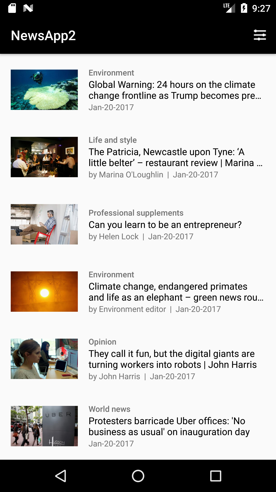
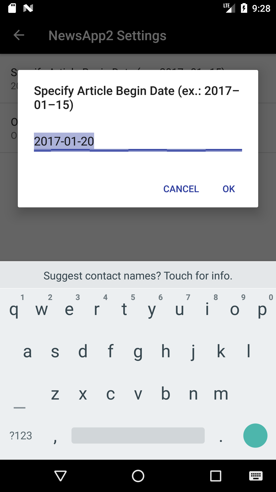

# NewsApp2

## Synopsis

Name: News App 2 (Including preference settings*)

This is an Android news application.

The purpose of the application is to create a news application which parses an URL from The Guardian and allows the user to read
new items from a list. 

The user can click on any news item in the list and read a web view of the story in detail. 
 
 *Included in this application are user preference settings: BEGIN DATE for articles and ORDER BY oldest or newest.

 <kbd></kbd><kbd></kbd>

## Code Description

The key features in the application are:  NewsActivity, News, NewsAdapter, NewsLoader, and QueryUtils, SettingsActivity

Preference settings layout:  

layout/settings_activity.xml 
xml/settings_main.xml
menu/main.xml

Structure of the code derives from the Earthquare application used in class:
https://github.com/udacity/ud843-QuakeReport

## Motivation

This is the seventh exercise in the "Grow with Google - Android Basic Development Nanodegree Scholarship 2018" program with Udacity.

The purpose of the exercise is to create "News app" with user preferences.

## Installation

Project can be downloaded from GitHub:  https://github.com/hillc255/NewsApp2

## API Reference

Source of content comes from the open-source API for The Guardian. 

## Tests (Future consideration!)

Describe and show how to run the tests with code examples.

## Contributors

Claudia Hill designed and developed this project.

## License

Only to be used for educational purposes.
